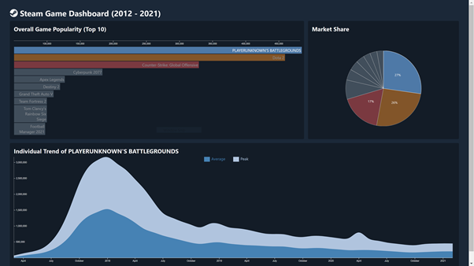
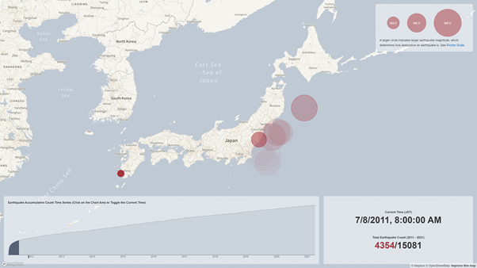

# CS5346 Information Visualization D3.js Assignment

This repository includes two D3.js assignments under different routes rendered via Svelte framework:

- [Steam Game Visualization](#steam-game-visualization)
- [Japan Earthquake Time Lapse Visualization](#japan-earthquake-time-lapse-visualization)

## Prerequisites

-   Node.js 15.3.0 or above

## Getting Started

Before running this project, run the following command to install the dependencies:

```bash
npm run install
```

To start this project in local server, run:

```bash
npm run dev
```

To serve the compiled and built scripts, run:

```bash
npm run build && npm run start
```

## Visualizations

### Steam Game Visualization

Visualization is available at route `/steam-game`:



For source code and chart definition, navigate to source folder `/src/routes/steam-game`.

### Japan Earthquake Time Lapse Visualization

Visualization is available at route `/japan-earthquake-time-lapse`:



For source code and chart definition, navigate to source folder `/src/routes/japan-earthquake-time-lapse`.
